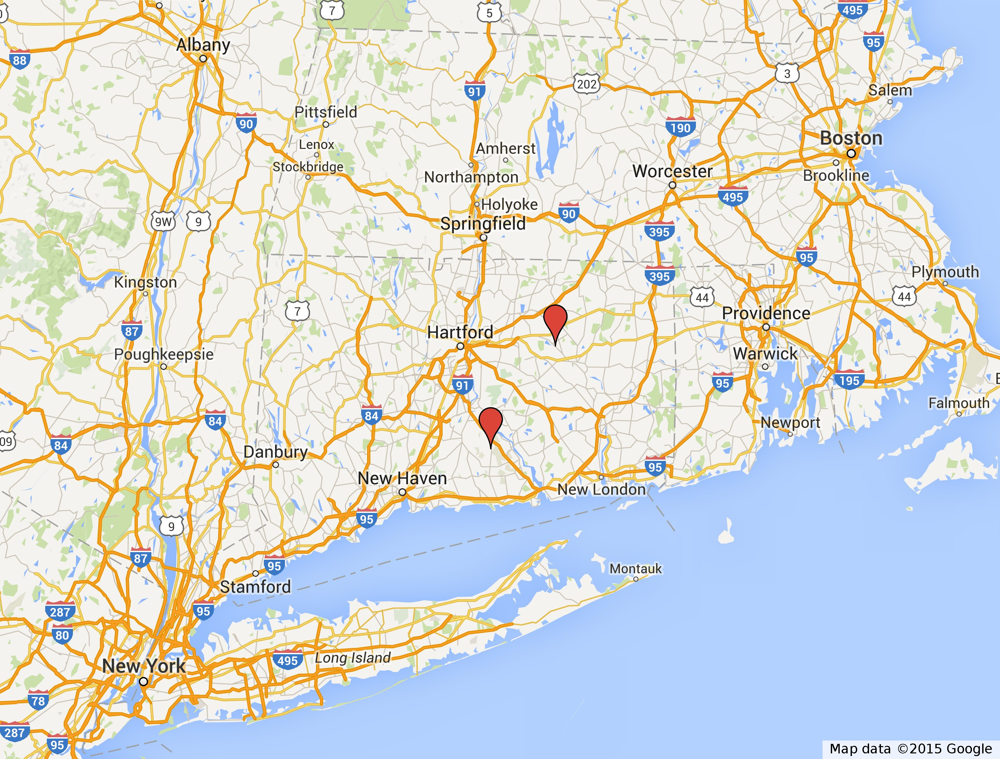

## Tutorial: Geocode addresses and view addresses in Google Earth or Google Maps

### If you do not yet have R Studio or R installed on your computer:
_Note: Both R and R Studio are free and open source software._

Download **R** at http://cran.rstudio.com/ and follow the instructions provided on the webpage for your operating system.

Download **R Studio** at http://www.rstudio.com/products/rstudio/download/. R Studio requires that you have R on your computer (version 2.11.1 or higher).

### Create a folder on your computer to store your files:

Make sure this folder is easily accessible and that you know how to locate your folder within your file system.
_Note: For users who have already created an account with GitHub, this step is not necessary. See alternate instructions below_

### Go to my GitHub Nestwatch website to view or copy the select files:
_Note: For users who have already created an account with GitHub, this step is not necessary. See alternate instructions below_


The Neighborhood Nestwatch page of my GitHub is locate at: https://github.com/bsevansunc/Nestwatch

For this tutorial, we will use three files located on this website:

* addressFileExample.csv

* source_functions.R

If you do not yet have a GitHub account, please send me an email at bsevans.unc@gmail.com and I will provide you with the necessary files.

If you do have a GitHub account, clone the Nestwatch repository onto your hard drive.

_Note: Be sure that you know the location of these three files on your hard drive!_

### Open R-Studio and follow the steps below to geocode the address files and create a KML file.
_Note: The geocoder uses Google Geocoder API (Application Program Interface), the same algorithm that Google Maps uses to locate an address. A KML file (Keyhole Markup Language) is a file format that can be viewed in Google Earth or Google Maps._

1. Determine the location of your current working directory (where your files are stored) by copying the following line into your script window and running the code (_First-time R-users: Put your mouse cursor on the line and run using the COMMAND+R (Mac) or CTRL+R (Linux/Windows) keyboard combination_). The working directory is the location on your computer where R Studio will read files and write new ones

```
getwd()
```

_First-time R-users: "getwd"" is a function. You can tell this because it is followed by parentheses._

2. Set the working directory to where you saved your files. Replace the address that I have provided with the location of the folder on your computer!

```
setwd('/Users/bsevans/gits/Nestwatch/')
```

_First-time R-users: Notice that "getwd" has empty parentheses and setwd contains information within the parentheses. Function specifications, including inputs, outputs, and formatting options, are located within parentheses._

2. Run the following "source" script. This contains the custom functions that we will use to write the latitude and longitude and Google Earth files. Betweeen the parentheses is the location on MY hard drive where _Note: this script includes a check to see if you have certain software packages loaded on your computer. If you do not, it will load the packages for you. It may take some time to load all of the necessary packages, however, it will only do this one time._

```
source('source_functions.R')
```

3. We will now add latitudes and longitudes to the "addressFileExample.csv" file. This file contains site names and addresses but does not include latitude and longitude data.  The inputs to the function are the location of the address file on your computer and where you want to store the new address file. Copy the script below and replace the path with the location on your computer in which you are working.

```
writeAddressToLatLong(addressFilePath = 'addressFileExample.csv', 
  outPath = 'addressFileExampleLL.csv')
```

4. Write KML. To do so, you must have already converted the participant address file to an address file that includes LatLongs.

```
PointsToKML(addressFilePath = 'addressFileExampleLL.csv',
  outPath = 'siteExampleKML.kml')
```

5. This file can now be viewed in Google Earth. To do so, simply:
  a. Open Google Earth
  b. Go to File/Open ... and select your file name to add the layer
  
6. You can also view this file in Google Maps as a "My Maps" document that can be shared with other users as well as viewed on users' computers, tablets, and smart phones! To do so, follow the steps below (_Note: These steps are copied-and-pasted from https://support.google.com/mymaps/answer/3024836?hl=en_):

  a. Open **My Maps** on your web browser (https://www.google.com/maps/d).
  b. Open a new or existing map.
  c. In the legend on the left, click the layer where you want to add data.
  d. Click **Import**. 
  e. "Drag" the KML from your computer or "Select a file from your computer".
  f. Click Choose a file to upload.
  g. Pick one or more columns that identify the location of your data. 
  h. Click Continue.
  i. Pick a single column to label the data on the map.
  j. Click Finish.

7. It is likely necessary that your maps are shared with other Google Maps users. It is important, however, to share with only certain users (e.g., technicians and Nestwatch coordinators). To share your maps, follow the steps located here:https://support.google.com/mymaps/answer/3024935?hl=en

### Voila!


